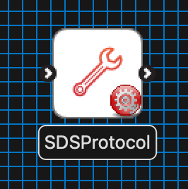
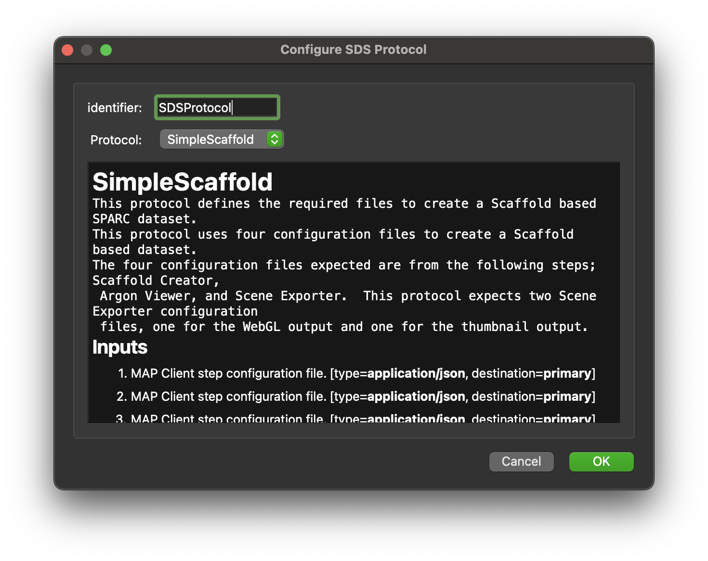

SDS Protocol
============

Overview
--------

The **SDS Protocol** is MAP Client plugin for gathering the requirements to fulfill a defined SDS protocol.

Workflow Connections
--------------------

As shown in :numref:`fig-mcp-sds-converter-workflow-connections`, the **SDS Protocol** requires a single input that is either a *http://physiomeproject.org/workflow/1.0/rdf-schema#file_location* or is a list of this type.

It produces one output, a *http://physiomeproject.org/workflow/1.0/rdf-schema#sds_protocol*, which may be piped to other workflow steps:

.. _fig-mcp-sds-converter-workflow-connections:

   **SDS Protocol** workflow connections.

Information on this plugins' specification is available :ref:`here <mcp-sds-converter-specification>`.

Configuration
-------------

This step is used for gathering the requirements to fulfill the defined protocol.
Current protocols supported are:

 * SimpleScaffold

.. _fig-mcp-sds-converter-configure-dialog:

   **SDS Protocol** step configuration dialog.

Instructions
------------

This is a non-interactive step.
See `Configuration`_.

.. toctree::
  :hidden:
  :caption: SDS Protocol
  :maxdepth: 1

  specification.rst
